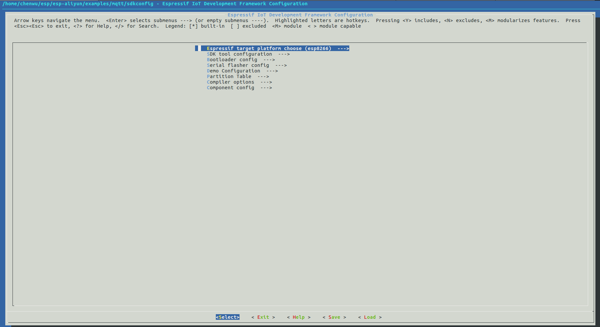
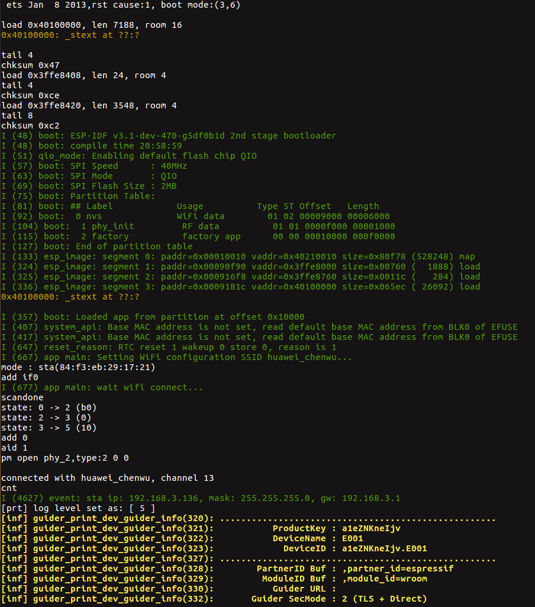
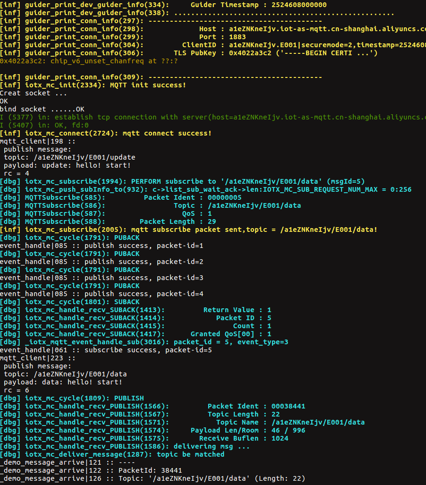

# ESP8266 对接阿里云指南

# 目录

- [介绍](#Introduction)  
- [一：目的](#aim)  
- [二：硬件准备](#hardwareprepare)  
- [三：阿里云平台准备](#aliyunprepare)  
- [四：环境搭建](#compileprepare)  
- [五：SDK 准备](#sdkprepare)  
- [六：编译&烧写&运行](#makeflash)  

# <span id = "Introduction">介绍</span>
[ESP8266](http://espressif.com/zh-hans/products/hardware/esp8266ex/overview) 是一颗低功耗、高集成度、性能稳定的 Wi-Fi 芯片，是物联网开发的首选设备。ESP8266EX 专为移动设备、可穿戴电子产品和物联网应用而设计，通过多项专有技术实现了最低功耗。ESP8266EX 有三种运行模式：激活模式、睡眠模式和深度睡眠模式，能够延长电池寿命。 ESP8266EX 是业内集成度最高的 Wi-Fi 芯片，最小封装尺寸仅为 5mm x 5mm。ESP8266EX 高度集成了天线开关、射频 balun、功率放大器、低噪放大器、过滤器和电源管理模块，仅需很少的外围电路，可将所占 PCB 空间降到最低。ESP8266EX 集成了更多的元器件，性能稳定，易于制造，工作温度范围达到 -40°C 到 +125°C。

[阿里云物联网套件](https://github.com/aliyun/iotkit-embedded)是阿里云专门为物联网领域的开发人员推出的，其目的是帮助开发者搭建安全性能强大的数据通道，方便终端（如传感器、执行器、嵌入式设备或智能家电等等）和云端的双向通信。全球多节点部署让海量设备全球范围都可以安全低延时接入阿里云IoT Hub，安全上提供多重防护保障设备云端安全，性能上能够支撑亿级设备长连接，百万消息并发。物联网套件还提供了一站式托管服务，数据从采集到计算到存储，用户无需购买服务器部署分布式架构，用户通过规则引擎只需在web上配置规则即可实现采集+计算+存储等全栈服务。总而言之，基于物联网套件提供的服务，物联网开发者可以快速搭建稳定可靠的物联网平台。

# <span id = "aim">一：目的</span>
本文基于 linux 环境和 windows 环境，介绍 ESP8266 对接阿里云平台的具体流程，供读者参考。

# <span id = "hardwareprepare">二：硬件准备</span>
- **linux 环境** 或 **windows 环境**  
用来编译&烧写&运行等操作的必须环境。  

- **ESP8266 设备**  
ESP8266 设备包括 [ESP8266 芯片](http://espressif.com/zh-hans/products/hardware/esp8266ex/overview)，[ESP8266 模组 ESP-WROOM-02](http://espressif.com/zh-hans/products/hardware/esp-wroom-02/overview)，[ESP8266 开发板 ESP-Launcher](http://espressif.com/zh-hans/products/hardware/development-boards)等。如:  



- **USB 线**  
连接 PC 和 ESP8266，用来烧写/下载程序，查看 log 等作用。

# <span id = "aliyunprepare">三：阿里云平台准备</span>
根据[阿里官方文档](https://github.com/aliyun/iotkit-embedded?spm=5176.doc42648.2.4.e9Zu05)，在阿里云平台创建产品，创建设备，同时自动产生 product key, device name, device secret。  
product key, device name, device secret 将在 6.1.1 节用到。

# <span id = "compileprepare">四：环境搭建</span>
**如果您熟悉 ESP8266 开发环境，可以很顺利理解下面步骤; 如果您不熟悉某个部分，比如编译，烧录，需要您结合官方的相关文档来理解。如您需阅读 [ESP8266 快速入门指南](http://espressif.com/zh-hans/support/download/overview)文档等。**  

## 4.1 编译器环境搭建
**linux 系统:**  
根据[官方链接](https://github.com/espressif/ESP8266_RTOS_SDK)中第二步 **Requirements**，下载并编译整个 esp-open-sdk。  
esp-open-sdk 中主要包含 ESP8266 SDK([ESP8266_RTOS_SDK](https://github.com/espressif/ESP8266_RTOS_SDK) 和 [ESP8266_NONOS_SDK](https://github.com/espressif/ESP8266_NONOS_SDK))的编译器 xtensa-lx106-elf， 以及 ESP SDK(ESP SDK 包括 esp-idf, ESP8266 SDK等) 的烧写工具 esptool。  
**注意**：编译 esp-open-sdk 过程中，国内可能会比较慢，挂载 VPN 会快一些。  

**windows 系统:**  
你有两种方式 a) 或 b) 获取编译器，推荐使用 a)  
a) 下载包含有编译器的 cygwin  
[下载链接](https://pan.baidu.com/s/1pKJJ97H)  
下载并解压 cygwin， cygwin 为用户贴心准备了 windows 下的 linux 环境和 ESP8266 的编译器 xtensa-lx106-elf。  
xtensa-lx106-elf 位于 cygwin/opt/ 目录下,更多信息请参考 cygwin/使用说明.pdf  
  
b) 下载虚拟机 && 下载包含有编译器的 lubuntu 镜像  
根据官方的 [ESP8266 SDK 入门指南](http://espressif.com/zh-hans/support/download/documents?keys=&field_type_tid%5B%5D=14) 中 3.3 节来获取编译器  

## 4.2 烧录工具/下载工具获取
**linux 系统：**  
烧录工具位于 4.1节中 esp-open-sdk/esptool/esptool.py  
烧录方式参考命令:  
```
$ esp-open-sdk/esptool/esptool.py --help
```

**windows 系统：**  
烧录工具链接：[Flash 下载工具(ESP8266 & ESP32)](http://espressif.com/zh-hans/support/download/other-tools)  
烧录方式参考 [ESP8266 SDK 入门指南](http://espressif.com/zh-hans/support/download/documents?keys=&field_type_tid%5B%5D=14) 中第六节下载固件  

# <span id = "sdkprepare">五：SDK 准备</span> 
用户可通过如下方式获取整个 SDK。  
```
$ git clone https://github.com/espressif/esp8266-aliyun.git
$ cd esp8266-aliyun
$ git submodule update --init --recursive
```

or

```
$ git clone --recursive https://github.com/espressif/esp8266-aliyun.git
```

目录结构如下：
```
├── bin				  // 存放编译后生成的文件
├── esp8266-rtos-sdk		  // esp8266 rtos 核心组件
├── gen_misc.sh			  // 编译命令
├── include			  // 用户可用的头文件
|	├── aliyun_config.h	  // 配置连接阿里云相关参数
|	├── mqtt.h		  // 用户可用的 mqtt 接口
|	└── ota.h		  // 配置 OTA 相关参数
├── Makefile			  // 总编译入口 makefile
├── mqtt			  // mqtt 实现
├── ota				  // OTA 实现
├── platforms			  // 适配阿里物联网套件
|	├── aliyun			  
|	│   ├── IoT-SDK_V2.0  	  // 阿里物联网套件
|	│   ├── Makefile	  // 套件编译 makefile
|	│   └── platform     	  // 物联网套件平台适配
|	├── Makefile		  // 套件编译 makefile
|	└── README.md	  	  // 说明文档
├── README.md			  // 说明文档
└── user			  // 用户程序入口
```

# <span id = "makeflash">六：编译&烧写&运行</span>
## 6.1 编译
### 6.1.1 SDK 修改
aliyun_config.h  
```
#define PRODUCT_KEY             "********"  // type:string
#define DEVICE_NAME             "********"  // type:string
#define DEVICE_SECRET           "********"  // type:string
...
#define WIFI_SSID       "********"       // type:string, your AP/router SSID to config your device networking
#define WIFI_PASSWORD   "********"       // type:string, your AP/router password
```

将第三节中阿里云平台产生的参数填充到 PRODUCT_KEY,DEVICE_NAME,DEVICE_SECRET   
将你可用的热点/路由器用户名密码填充到 WIFI_SSID,WIFI_PASSWORD  

### 6.1.2 导出编译器
导出 4.1 节下载的编译器，如：  
```
$ export PATH=/opt/xtensa-lx106-elf/bin/:$PATH
```
### 6.1.3 编译 SDK

```
$ ./gen_misc.sh
```

编译完成后，将生成 `esp8266-aliyun/bin/upgrade/user1.2048.new.5.bin` 固件。  

## 6.2 烧写/下载固件
将 USB 线连接好 ESP8266 和 PC,确保下面烧写端口正确。windows 烧写方法参考 4.2 节，烧写 bin 和烧写地址参考 6.2.2 节。  

### 6.2.1[可选] 擦除 flash
```
$ ~/esp/esp-open-sdk/esptool/esptool.py --port /dev/ttyUSB0 --baud 921600 erase_flash
```

### 6.2.2 烧录程序
```
$ ~/esp/esp-open-sdk/esptool/esptool.py --port /dev/ttyUSB0 --baud 921600 write_flash --flash_size 2MB-c1 0x1000 bin/upgrade/user1.2048.new.5.bin 0x0000 ~/bin/boot_v1.6.bin  0x1fc000 ~/bin/esp_init_data_default.bin 0x1fe000 ~/bin/blank.bin
```

## 6.3 运行
打开串口工具，连接，连接配置如下:  
波特率: 74880  
数据位: 8  
停止位: 1  
奇偶校验: None  
流控: None  

如 linux 中使用 miniterm 串口工具：  
```
$ miniterm.py /dev/ttyUSB3 74880
```

将 ESP8266 拨至运行状态，即可看到如下 log：  
log 显示了 ESP8266 基于 TLS 建立了与阿里云的安全连接通路，接着通过 MQTT 协议订阅和发布消息，同时在阿里云控制台上，也能看到 ESP8266 推送的 MQTT 消息。  






