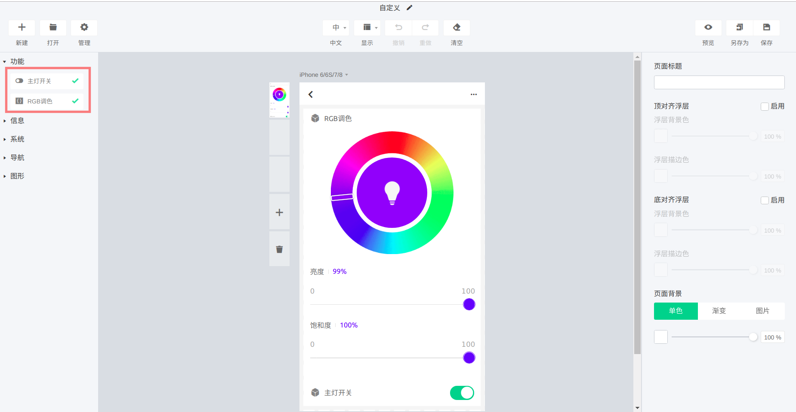
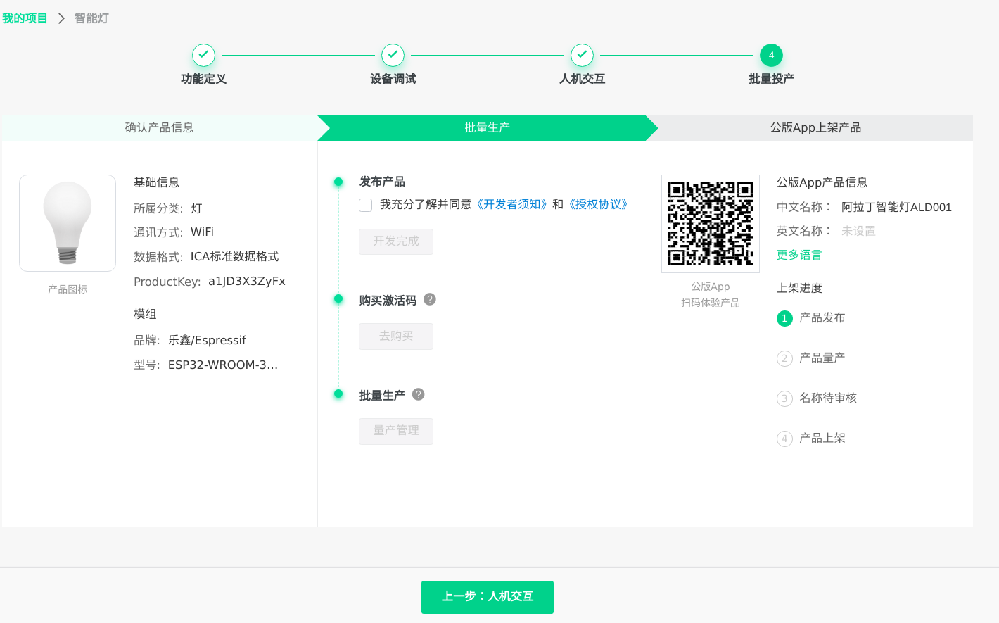
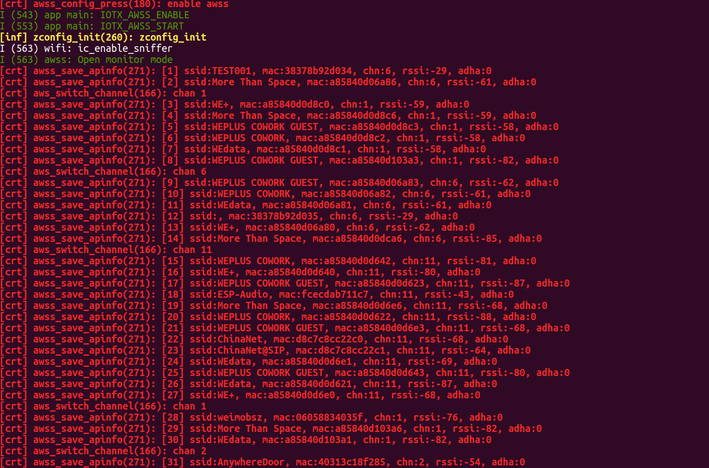
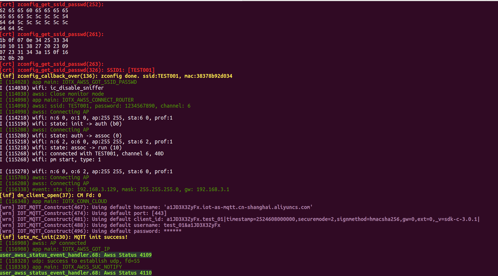
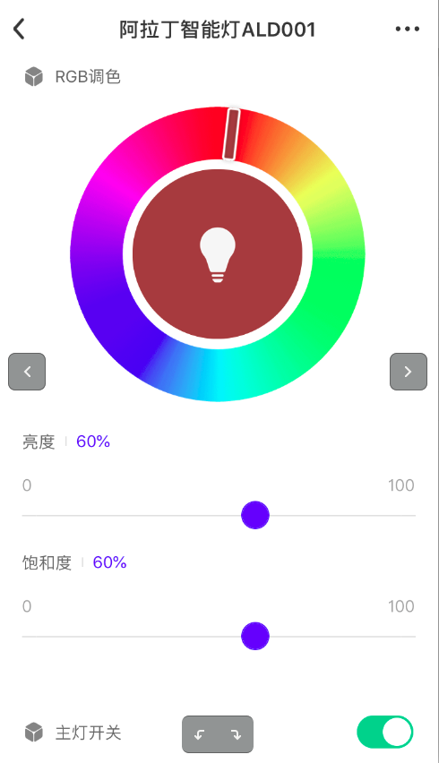

# Smart Light 解决方案

### 介绍
`Smart Light` 为客户提供智能灯产品的解决方案. 客户几乎不需要投入软件开发, 即可以:  
- 支持阿里 <智能家居> APP 一键配网
- 支持阿里 <智能家居> APP 控制设备
- 支持 LED 控制(开关,颜色等)
- 支持 OTA 升级

### 解决方案部署
#### 1.参考 [README](../../../README.md) 文档进行硬件准备、环境搭建、SDK 准备

#### 2.阿里云平台部署
在阿里云 [生活物联网平台](https://living.aliyun.com/#/) 创建产品, 参考[创建产品文档](https://living.aliyun.com/doc#readygo.html).
> 配置较多, 如果不太懂, 也不用纠结, 后续都可以修改.

部署自己的产品, 可参考如下:
新增 RGB 调色功能:


新增测试设备, 此处即可以获得`三元组`, 后续需要烧录到 NVS 分区.


选择面板, 手机 APP 上会显示同样界面; `配网二维码`是贴在产品包装上, 终端客户给设备配网中需扫描此二维码.


选择面板时, 主题面板在手机上仅能显示标准界面, 没有 RGB 调色功能. 可以自定义面板, 增加 RGB 调色.




配网方案选择:


完成


#### 3.下载本工程
   ```
    git clone https://github.com/espressif/esp-aliyun.git
    cd esp-aliyun
   ```

#### 4.烧录三元组信息
- 参考 [量产说明](../../../config/mass_mfg/README.md) 文档烧录三元组 NVS 分区.

> 如果执行了 `make erase_flash`, 需要重新烧录三元组.

#### 5.配置 `smart light example`
- RGB 灯分别接 ESP32/ESP8266 开发板上 `GPIO0`, `GPIO2`, `GPIO4` (可在 `lightbulb.c` 中修改)

#### 6.编译 `smart light` 并烧录运行
```
cd examples/solutions/smart_light
make chip=esp32 defconfig 或者 make chip=esp8266 defconfig
make -j8 flash monitor
```

> 在测试配网中, 请先执行 `make erase_flash` .

#### 7.设备第一次运行时, 会进入配网



#### 8.手机从[阿里云官网](https://living.aliyun.com/doc#muti-app.html) 下载 `智能家居` 公版 APP, 国内用户版.

#### 9.注册好账号后,进入 APP, 右上角扫描, 扫描第二步的二维码配网.
设备端配网成功后会保存 `ssid` 和 `password` :


设备与手机绑定成功后, APP 上会弹出灯的配置页面. 返回主页显示灯 `在线` .


#### 10.控制智能灯

在 APP 上打开灯, 设备端收到消息:


在 APP 上设置 RGB 调色:


设备端即解析 RGB 颜色, 并设置到具体的灯产品上.


#### 11.OTA 支持
参考 examples/ota/ota_example_mqtt 示例下的 [README](../../ota/ota_example_mqtt/README.md)

### 后续计划
- 支持天猫精灵控制
